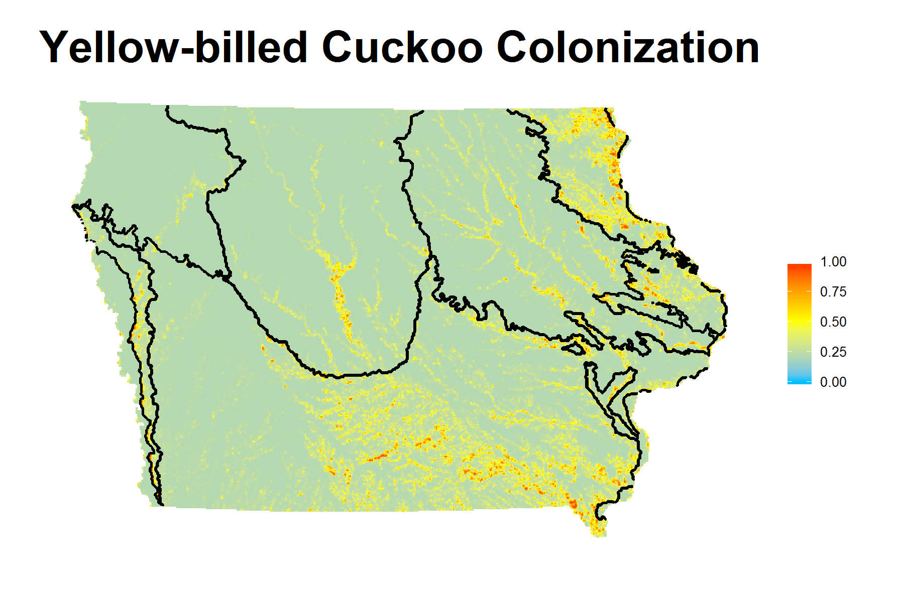
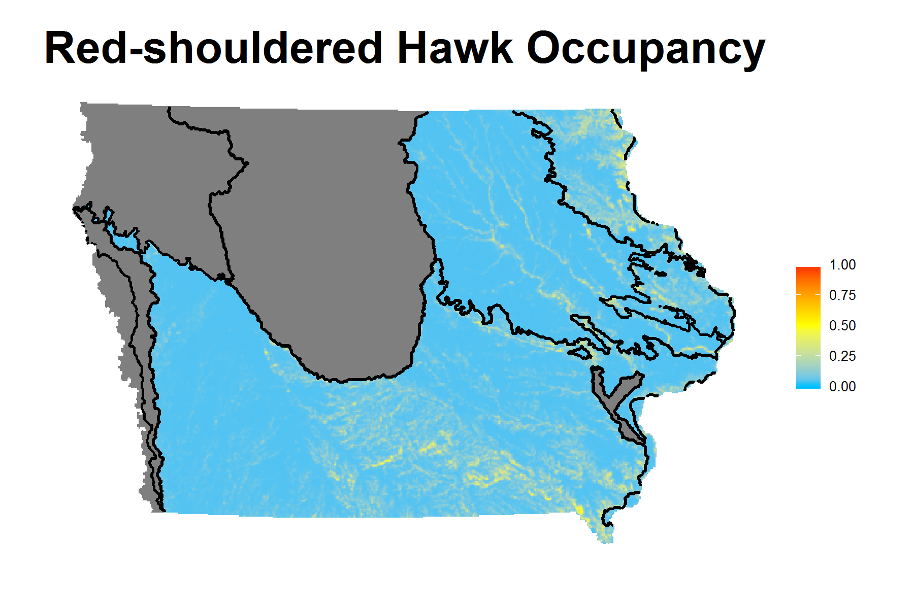

```{r setup, include=FALSE}
knitr::opts_chunk$set(echo = FALSE, warning = F, message = F)
```

## Introduction

- Period: Oct 2015 - May 2016

- State Wildlife Grants - Iowa Department of Natural Resources

- Run predictive models using R package RMark

- Produce predictive maps using ArcGIS

- Develop an interactive web application using Shiny 

---
## Outline

- Project overview: data source and objectives

- Methods: model fit and covariates

- Model Validation: AUC

- Results: example of estimates table and predictive maps

- Demonstrate Shiny application

---
## Data Collection

- Multiple Species Inventory and Monitoring (MSIM) Program  

    + Iowa DNR and Iowa State University
    
- Sampling Interval  

    + Primary: 2006-2014
    
    + Secondary: survey occasions (days)
    
- Survey Objects  

    + 414 SGCN, only 69 SGCN where sufficient data were available
    
    + Birds, mammals, reptiles, amphibians, odonates and butterflies

---
## Objectives

- Predict the distribution of species of conservation need 

    + robust design occupancy model
    
- Create predictive species maps for priority SGCN  

    + ArcGIS raster files
    
    + Shiny interactive web application
    
- Prioritize areas of conservation action for SGCN  

    + habitat restoration and management

---
## Methods

- Robust design occupancy model (MacKenzie et al. 2003)  

    + package RMark
    
- Parameters of Interest  

    + probability of occupancy ( $\psi$ )
    
    + probability of colonization ( $\gamma$ )
    
    + probability of extinction ( $\epsilon$ )
    
    + probability of detection ( $p$ )
    
- Model types

    + RDOccupEG, RDOccupPE, RDOccupPG, ...

---
## Statistical Model

$$Pr(\mathbf{X}_i) = \boldsymbol{\phi}_0 \Bigg\{\prod_{t=1}^{T=1}D(\mathbf{p}_{X,t})\boldsymbol{\phi}_t \Bigg\} \mathbf{p}_{X,T}$$

- $\mathbf{p}_{X,t}$ : vector denoting probability of observing the detection history $X_{i,t}$ in primary period $t$
- $\boldsymbol{\phi}_t$ : matrix of transition probabilities between states of occupancy from primary period $t$ to $t+1$
$$\begin{aligned}
\boldsymbol{\phi}_t &= \begin{bmatrix} P(X_{t+1}=1|X_t=1) & P(X_{t+1}=0|X_t=1) \\
P(X_{t+1}=1|X_t=0) & P(X_{t+1}=0|X_t=0) \end{bmatrix} \\
&= \begin{bmatrix} 1-\epsilon_t & \epsilon_t \\ \gamma_t & 1-\gamma_t \end{bmatrix},
t = 1, ..., \text{T-1}
\end{aligned}$$

$$\phi_0 = \begin{bmatrix} \psi_1 & 1-\psi_1 \end{bmatrix}$$

---
## Example

$$\begin{aligned}
Pr(\boldsymbol{X}_{i,1} = 010) &= \psi_1(1-p_{1,1})p_{1,2}(1-p_{1,3}) \\
Pr(\boldsymbol{X}_{i,2} = 000|\boldsymbol{X}_{i,1}) &= (1-\epsilon_1)\prod_{j=1}^3(1-p_{2,j})+\epsilon_1 \\
Pr(\boldsymbol{X}_i = \text{010 000}) &= \phi_0 D(\boldsymbol{p}_{010,1}) \phi_1 \boldsymbol{p}_{000,2} \\
&= \begin{bmatrix} \psi_1 & 1-\psi_1 \end{bmatrix} 
\begin{bmatrix} (1-p_{1,1})p_{1,2}(1-p_{1,3}) & 0 \\ 0 & 0 \end{bmatrix} \\
&\ \ \ \times \begin{bmatrix} 1-\epsilon_1 & \epsilon_1 \\ \gamma_1 & 1-\gamma_1 \end{bmatrix} 
\begin{bmatrix} \prod_{j=1}^3(1-p_{2,j}) \\ 1 \end{bmatrix} \\
&= \psi_1(1-p_{1,1})p_{1,2}(1-p_{1,3})\Big[(1-\epsilon_1)\prod_{j=1}^3(1-p_{2,j})+\epsilon_1\Big]\end{aligned}$$

---
## Statistical Model (cont'd)

- Including Covariates
$$\theta = \frac{\exp(\boldsymbol{Z'\beta})}{1+\exp(\boldsymbol{Z'\beta})}$$
   
    + $\theta$ is the probability of interest
    
    + $\mathbf{Z}$ is the matrix of covariate information
    
    + $\boldsymbol{\beta}$ is the vector of logistic model coefficients to be estimated

---
## Covariates    

- Landscape habitat variables <sup>[1]</sup>

    + Radius of sampled site: 200m, 500m and 1km
    
    + Land use classification:   
      Water, Wetland, Grassland, Woodland and Agriculture
      
    + Landscape configuration:  
      percentage of landscape (PLAND), large patch index (LPI),
      edge density (ED), patch density (PD) and interspersion-juxtaposition (IJI)
      
- Climate variables <sup>[2]</sup>

    + Wind speed (km/h), Cloud cover (%), Temperature ( $^\text{o}\text{C}$ )

.footnote[
[1] site-specific, modeled on $\psi, \gamma$ and $\epsilon$

[2] time-varying, modeled on $p$
]

---
## Model Selection and Validation

- Akaike's Information Criterion adjusted for small sizes ( $\text{AIC}_c$ )  

    + Models with $\Delta \text{AIC}_c \leq 2 \Rightarrow$  strong support  
      (Burnham and Anderson 2002)
      
- Area under the receiver operating characteristic curve (AUC)  

    + evaluate performance of predicting occupancy
    
    + training data set: survey years 2006-2012, 2014
    
    + test data set: survey year 2013 (better representative)
    
    + package pROC
    
    + $\text{AUC} = 0.5 \Rightarrow$ random guess
    
    + $\text{AUC} = 1.0 \Rightarrow$ perfect prediction  
      (Jimenez-Valverde 2012)

---
## ROC Curve

```{r, message=F, fig.height=6, fig.width=8, fig.align='center'}
library(pROC)
y <- rbinom(100, size = 1, prob = 0.5)
p <- plot.roc(y, y, main = "ROC Curve: Random Guess VS Perfect Prediction",
     print.auc = T, auc.polygon = T, print.auc.x = 0.9, print.auc.y = 0.9,
     identity.col = "red", identity.lwd = 2,
     xlab = paste("Specificity", " p(0|0)"),
     ylab = paste("Sensitivity", " p(1|1)"))
```       

---
## Results

Results Summary  

| Statistics | Value/Range | 
| --------------------------------- | -------- |
| Number of SGCN modeled | 64 out of 69 |
| Occupancy Prob $\hat\psi$ | 0.001(0.0003)~0.995(0.004) |
| Colonization Prob $\hat\gamma$ | 0.0003(0.0001)~0.999(0.00007) |
| Detection Prob $\hat p$ | 0.030(0.028)~0.998(0.006) |
| AUC values | 0.426~0.921 |
| Number of $\text{AUC} > 0.5$ | 61 out of 64 |

---
## Results (Cont'd)

Best Models for Each Specie

```{r, eval=F, echo = F}
d <- read.csv("data/Bird_All_Woodland_Estimate.csv")
knitr::kable(xtable::xtable(head(d[,2:3]))
```  

|Species               |Model                                         |
|:-------------------------------------------|:------------------------------|
|Red-shouldered Hawk   | $\psi$(Wod1KPLND) $\gamma$(Ag1KPD)p(Cld)       |
|Yellow-billed Cuckoo  | $\psi$(Wod500PLND) $\gamma$(Wod1kLPI)p(Wind)   |
|Red-headed Woodpecker | $\psi$(Wod500PLND) $\gamma$(Ag500PD)p(Cld)     |
|Eastern Wood-pewee    | $\psi$(Wod500PLND) $\gamma$(Wod1KPLND)p(Wind)  |
|Acadian Flycatcher    | $\psi$(Wod500PLND) $\gamma$(Wod500PLND)p(Wind) |
|Veery                 | $\psi$(Wod1kED) $\gamma$(Ag500LPI)p(Wind)      |


---
## Results (Cont'd)

AUC and Coefficients Estimates under Best Model

```{r, echo=FALSE, eval = T}
library(DT)
d <- read.csv("data/Bird_All_Woodland_Estimate.csv")
DT::datatable(head(d[,c(2,4,5,7,9)]), options = list(dom = 't')) %>% DT::formatRound(2:5, 3)
```

---



---



---
## Shiny

- **Shiny** by RStudio is a web application framework for R. 

- No HTML, CSS or JavaScript knowledge required to turn your analyses into interactive web applications.

```{r, eval=FALSE, echo=T}
install.packages("shiny")
library("shiny")
runExample("01_hello")
```

- ui.R defines the page layout and user interface

- server.R contains the R code to create any output

- More information available at [Shiny Webpage](http://shiny.rstudio.com/)

---
## About Our Shiny Application

- Interactive web application to display predictive maps and parameter estimates for each SGCN

- Easy to download personalized data and maps

- Available to researchers and managers across Iowa (credentials needed)

- Hosted by CSSM for 1-2 years

- The URL for accessing the application is [https://dnrswg.cssm.iastate.edu/](https://dnrswg.cssm.iastate.edu/)

